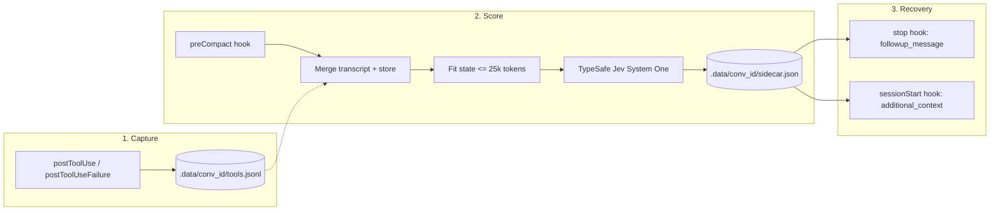
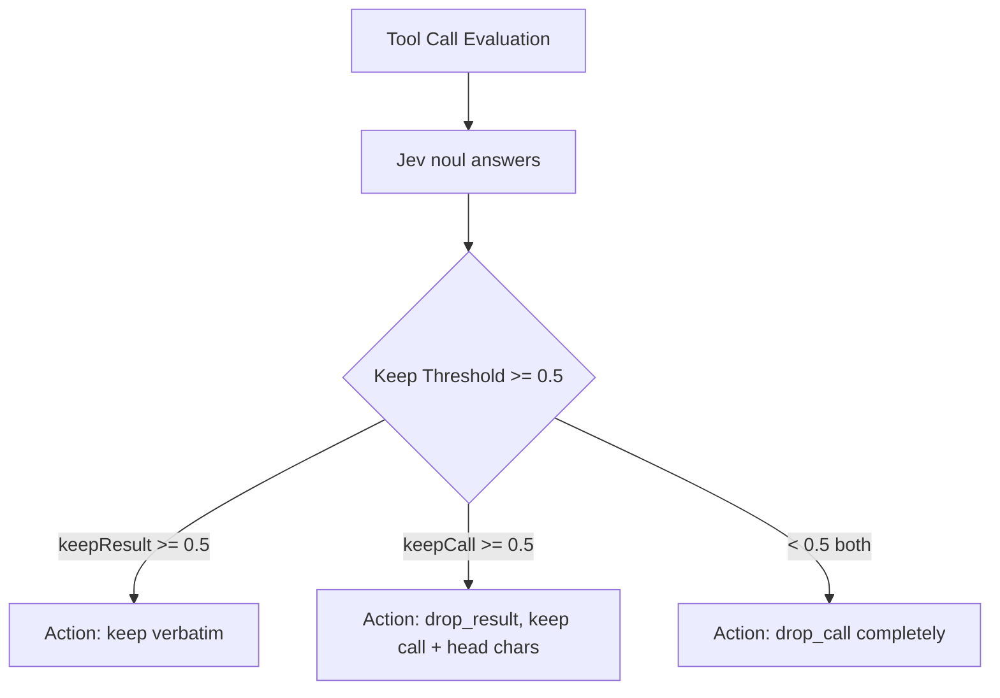

<div align="center">

<h1 align="center">cursor-clijev-compaction ⚡</h1>

<p align="center">
  <strong>TypeSafe Jev-scored context recovery for Cursor CLI (<code>agent</code>). Verbatim facts, zero user hook mutations.</strong>
</p>

<p align="center">
  <a href="LICENSE"></a>
  <a href="package.json">=18"></a>
  <a href="package.json"></a>
  <a href="https://cursor.com/docs/cli/overview"></a>
  <a href="tests/"></a>
</p>

<p align="center">
  <a href="#architecture">Architecture</a> •
  <a href="#the-decision-space">Decision Space</a> •
  <a href="#try-it">Quickstart</a> •
  <a href="#use-the-library">Usage</a> •
  <a href="#why-it-moves">Why It Moves</a> •
  <a href="#small-enough-to-read">Codebase</a> •
  <a href="#evidence-and-limits">Evidence & Limits</a> •
  <a href="SECURITY.md">Security</a>
</p>

<p align="center">
Give it Cursor CLI execution history. TypeSafe Jev scores each tool call and result with atomic <code>noul</code> questions.<br>
Kept tool facts survive native compaction verbatim; stale outputs drop without losing code constraints.
</p>

<p align="center">
<b>Built strictly for the Cursor CLI (<code>agent</code> binary).</b><br>
Zero modifications to <code>~/.cursor/hooks.json</code>. Pure opt-in via <code>agent --plugin-dir</code> or <code>cursor-jev agent</code>.
</p>

</div>

<br>

## Architecture

Cursor's `preCompact` hook is purely observational (`user_message` only) and cannot replace or suppress native compact. `cursor-clijev-compaction` bridges this limitation by capturing tool I/O, scoring state with TypeSafe Jev, and re-injecting kept facts into the next turn.



Native summarization still runs. Instead of losing vital file paths, test failures, and constraints to LLM summary drift, the assistant receives a high-density, verbatim recovery block right after compaction finishes.

## The decision space

Every non-pinned tool call generates two atomic [`noul`](https://docs.typesafe.ai/primitives/noul.md) questions sent to TypeSafe Jev System One (`POST https://api.typesafe.ai/v1/systemone`, model `jev-latest`):

1. **`call_<id>`**: Should knowing this call was made (and its input arguments) stay in context?
2. **`result_<id>`**: Should the full output stay in history verbatim, or can the assistant re-run it if needed?



### Deterministic Policy

- **Pinned boundary**: The initial prompt and the newest messages (`preserveRecentMessages`, default 6) are pinned and never dropped.
- **State fitting**: Fits conversation history into a `25,000` token budget through 6 progressive stages (input truncation, head/tail text abridging, old message collapse, call one-liners, call merging).
- **Request budgeting**: Batches questions concurrently so state + questions never exceed `30,000` tokens (safely within Jev's 32k ceiling).

## Try it

### 1. Setup

```bash
git clone https://github.com/kleosr/cursor-clijev-compaction.git
cd cursor-clijev-compaction
pnpm install
pnpm build
export TYPESAFE_API_KEY=your_typesafe_key
cursor-jev doctor
cursor-jev agent --
```

Same TypeSafe key as the Claude plugin. `cursor-jev agent` starts Cursor CLI with `--plugin-dir` and forwards `TYPESAFE_API_KEY` into the `agent` process so hooks can score with `jev-latest`. It never writes `~/.cursor/hooks.json`.

### 2. Run with Cursor CLI (`agent`)

Use the `cursor-jev` wrapper. It executes `agent --plugin-dir <this-repo>` without touching any global configuration:

```bash
# Interactive agent session
cursor-jev agent --

# Non-interactive script / CI invocation
cursor-jev agent -- -p "fix flaky test in tests/auth.test.ts"

# Resume an existing session
cursor-jev agent -- --resume
```

Alternatively, invoke Cursor's native `agent` CLI directly by passing the plugin flag:

```bash
export TYPESAFE_API_KEY=your_typesafe_key
agent --plugin-dir /path/to/cursor-clijev-compaction
```

### 3. Offline Compactor

Inspect and score past Cursor transcripts offline without running the agent loop:

```bash
cursor-jev compact ./tests/fixtures/cursor-with-result.jsonl
```

Needs `TYPESAFE_API_KEY`. Prints JSON (messages, decisions, stats). Does not call Cursor. Without a key it exits 1 — there is no fake scorer.

## Use the library

The core engine is self-contained and exported as an ESM package:

```ts
import { compact, compactMessages, type Message } from 'cursor-clijev-compaction';

const transcript: Message[] = [
  { role: 'user', text: 'Fix the failing test. Never touch src/auth.ts', toolUses: [] },
  {
    role: 'assistant',
    text: '',
    toolUses: [{ tool_use_id: 'tool_1', tool: 'Read', input: { path: 'tests/a.test.ts' } }],
  },
  {
    role: 'user',
    text: '',
    toolUses: [],
    toolResults: [{ tool_use_id: 'tool_1', text: 'AssertionError: expected 1 to be 2' }],
  },
];

// Single call against TypeSafe System One
const result = await compactMessages(transcript, {
  apiKey: process.env.TYPESAFE_API_KEY,
  preserveRecentMessages: 2,
});

console.log(result.decisions);
// [ { id: 't1', tool: 'Read', action: 'keep', reason: 'kept', keepCall: 0.92, keepResult: 0.88 } ]

console.log(result.stats);
// { calls: 1, kept: 1, resultsDropped: 0, callsDropped: 0, ms: 340, ... }
```

There is no stub scorer and no custom transport in the product path. `compactMessages` always calls TypeSafe Jev (`jev-latest`) at `POST https://api.typesafe.ai/v1/systemone`. Without `TYPESAFE_API_KEY`, that call is skipped in Cursor CLI hooks (native compact continues) and `cursor-jev compact` exits 1.

## Why it moves

- **Never touches user configuration.** Zero writes to `~/.cursor/hooks.json`, workspace hooks, or CLI configs. No destructive installer.
- **Verbatim fact recovery.** Standard LLM summaries discard exact compiler outputs, diffs, and constraints. Jev decisions selectively preserve full text where it matters.
- **Resolves Cursor's missing-result gap.** Cursor JSONL transcripts often serialize `tool_use` without matching `tool_result` blocks. Our `postToolUse` hook captures outputs directly to guarantee full context.
- **Tokenizer-free state fitting.** Calibrated character-class token estimation prevents budget overflow under Jev's 32k token limit without WASM binary dependencies.
- **Fail-open Cursor CLI.** Missing `TYPESAFE_API_KEY`, TypeSafe downtime, or a history that will not fit skip scoring and print JSON. Native compact still runs (`failClosed: false`). `cursor-jev compact` (offline) fails closed without a key.
- **Loop-breaker protection.** The `stop` hook enforces `loop_limit: 1` so recovery messages never trigger recursive agent loops.

## Small enough to read

The codebase is lean, strictly typed, and free of decorative abstractions:

| File | Job | Lines |
| --- | --- | ---: |
| [src/cli.ts](src/cli.ts) | CLI wrapper (`agent --plugin-dir`), `doctor`, and offline `compact` | ~160 |
| [src/agent.ts](src/agent.ts) | Resolve Cursor CLI `agent` on PATH or `%LOCALAPPDATA%\cursor-agent` | ~20 |
| [src/compact.ts](src/compact.ts) | Decision logic, question batching, and transcript rebuilding | ~250 |
| [src/hook.ts](src/hook.ts) | Hook lifecycle router (`postToolUse`, `preCompact`, `stop`, `sessionStart`) | ~200 |
| [src/inject.ts](src/inject.ts) | Markdown recovery payload generator with byte budget enforcement | ~90 |
| [src/jev.ts](src/jev.ts) | TypeSafe System One client (`POST /v1/systemone`, `jev-latest`) | ~110 |
| [src/paths.ts](src/paths.ts) | Path resolvers for `.data/<conversation_id>/` and `CURSOR_JEV_HOME` | ~50 |
| [src/payload.ts](src/payload.ts) | Robust extraction for Cursor hook stdin schemas | ~110 |
| [src/state.ts](src/state.ts) | Six-stage state fitting under the 25k token ceiling | ~240 |
| [src/store.ts](src/store.ts) | Append-only tool capture store & transcript merging | ~110 |
| [src/tokens.ts](src/tokens.ts) | Fast character-class token estimator | ~25 |
| [src/transcript.ts](src/transcript.ts) | Streaming Cursor JSONL transcript parser | ~160 |
| [src/types.ts](src/types.ts) | Data models, hook schemas, and Jev protocol interfaces | ~130 |

## Evidence and limits

### Verification

```bash
pnpm test
pnpm typecheck
```

- **Vitest**: TypeSafe client contract (`POST https://api.typesafe.ai/v1/systemone`, `Authorization: Bearer`, `jev-latest` noul answers), store merge, hook stdin/stdout, wrapper `--plugin-dir`, `doctor`, and no-key fail-open for Cursor CLI.
- **Safety**: `cursor-jev install` exits 2 and never creates `~/.cursor/hooks.json`.

### Honest Limits

- **Cursor CLI only**: Built exclusively for the `agent` command-line binary. Does not run in Cursor IDE Agent Chat, Cmd+K, Tab completions, or remote Cloud Agents.
- **Observational `preCompact`**: Cursor CLI does not allow plugins to replace the compact summary in-flight (unlike Claude Code's `session.compact`). Kept facts are injected on the immediately following turn.
- **Local store**: Tool outputs are cached in `.data/<conversation_id>/` within this repository (or `CURSOR_JEV_HOME`). Never written to `~/.cursor`.
- **TypeSafe only**: Scoring is always TypeSafe Jev (`jev-latest`). No stub, Ollama, or custom asker in the product path. `TYPESAFE_API_KEY` is required to score ([docs](https://docs.typesafe.ai)).

## Development

```bash
# Run unit and integration tests
pnpm test

# Run strict TypeScript compiler verification
pnpm typecheck

# Build ESM artifacts to dist/
pnpm build
```

---

<div align="center">

<p align="center">
  <a href="https://docs.typesafe.ai">TypeSafe Jev Documentation</a> •
  <a href="https://cursor.com/docs/cli/overview">Cursor CLI Reference</a> •
  <a href="https://agent-plugins.org">Agent Plugins Standard</a>
</p>

</div>
